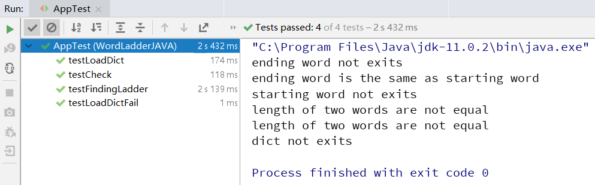

# User guideline for WordLadder

## What will this program do?

This is a command line program aiming to find a ladder between two words. You will give the program two words and it will offer you a ladder. The ladder will follow the rules that:

1. The ladder begins with the first word and finishes with the second word. 
2. Only one letter can be changed at a time
3. Each intermediate word must exist in the dictionary

## How can you use it?

You can use it by jar file in `/target`. Put the dictionary file in the same folder and execute the following instructions:

```powershell
    java -jar .\WordLadderJAVA-1.0-SNAPSHOT.jar
```

Then you will see prompts that prompts you to enter the words. Just follow the prompts.

If you see a prompt shows `dict not exits`, it means that the program can't find the dictionary file, check is the file is in the same folder.

## About Unit Tests

Most functions are unit tested. Results are in `/target/surefire-reports`. Here is a screenshot of result showed in intellij IDEA.

<div style="align: center">

</div>